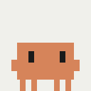
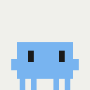
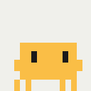
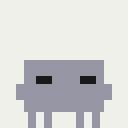
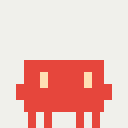

# claude-pet

> A desktop pet that grows as you use Claude

**English** | [한국어](README.ko.md)

A Windows desktop pet plugin for Claude Code. It wanders along your taskbar
while you work, shows what Claude is doing right now through its body color,
and levels up with your cumulative usage.


## Why

Use Claude Code long enough and your usage piles up as nothing but numbers.
I wanted that time to leave a visible trace — so I built a pet that grows as
I use Claude. It computes cumulative usage from your transcripts and shows it
as a level (no dollar amount is ever displayed), and a ring flashes around it
the moment it levels up. Max level: 9999.

One principle shaped everything else: **the pet is a decoration, and it must
not interfere with your work — not even 1%.** The entire design below follows
from that.

## States at a glance

The pet watches every open Claude Code session and shows the highest-priority
state through its body color and animation.

| Look | Color | State | Behavior |
|:---:|---|---|---|
|  | Coral `#D6845A` | Idle | Wanders along the taskbar |
|  | Coral `#D6845A` | Your turn | A question mark floats overhead |
|  | Blue `#78B4F0` | Reading (Read/Grep/search) | Eyes scan left and right |
|  | Green `#8CE196` | Writing (Edit/Write) | |
|  | Amber `#FABE46` | Running a tool | Leans forward as it runs |
|  | Gray-blue `#9696A5` | Tool error | Eyes squeezed shut, staggering |
|  | Red `#E6463C` | Blocked on a permission prompt | Anger mark (💢) overhead |
|  | Near-black `#34323C` | Abandoned | Lies flat on the floor |
|  | Slate `#60647A` | Token limit reached | Naps with a Zzz — wakes itself at reset time |

With multiple sessions open, per-session states are aggregated into one:
blocked > your turn > working — so a session waiting for your approval never
goes unnoticed.

## Features

- **State reactions** — tails each session's transcript (JSONL) in real time
  and classifies the states above. It never sends a single request to Claude
  Code itself.
- **Levels** — recomputes cumulative usage in the background every 30
  seconds and shows it as an `Lv` number. It remembers each file's (size,
  mtime) and rescans only what changed, so multi-GB transcript histories
  cost nothing.
- **Token-limit nap** — when you hit a session or weekly limit, the pet lies
  down and sleeps. It reads the reset time from the transcript, wakes itself
  at that moment, and gets up immediately if activity resumes earlier.
- **Stays out of the way** — the window is click-through, never steals
  focus, and hides when a fullscreen app (like a game) is in front. It shuts
  itself down about 10 seconds after your last session ends.

## Install

In the Claude Code **terminal chat**:

```
/plugin marketplace add Youl-AI/claude-pet
/plugin install claude-pet@claude-pet
```

Start a new session and the pet appears.

In the VSCode/desktop GUI, slash commands don't take arguments — use a
**shell (PowerShell/cmd)** instead:

```powershell
claude plugin marketplace add Youl-AI/claude-pet
claude plugin install claude-pet@claude-pet
```

### Requirements

- Windows 10/11
- [.NET Desktop Runtime 10+](https://dotnet.microsoft.com/download/dotnet)
  (built to roll forward to later major versions)
- Claude Code

### Update

```
/plugin marketplace update claude-pet
/plugin install claude-pet@claude-pet
```

Or from a shell: `claude plugin update claude-pet@claude-pet`. Restart
Claude Code to apply. Auto-update is off by default for third-party
marketplaces; you can turn it on under `/plugin` → Marketplaces.

### Uninstall

```powershell
claude plugin uninstall claude-pet@claude-pet
```

The pet exits on its own once every session has ended. To take it down
immediately: `taskkill /IM claude-pet.exe /F`.

## How it works

```
Claude Code session
  │  SessionStart / Notification / SessionEnd hooks (async, always exit 0)
  ▼
session records (sessions/*.json)  ←  hooks only write these and return
  │
  ▼
claude-pet.exe (WPF, single instance)
  ├─ every 1s:  check session PIDs are alive + tail transcripts → classify state
  ├─ every 30s: rescan changed transcripts only → compute level
  └─ 10s after the last session dies → exits itself
```

The hooks only register the session and make sure one pet process is
running. From there the pet follows the transcript files **read-only** and
makes every decision on its own. There is no code path that sends a request
to Claude Code or waits on it.

## Design priorities

### 1. Zero interference

- **Every hook is async and unconditionally `exit 0`** — no failure inside a
  hook script can ever stall a session.
- **Transcripts are opened with `FileShare.ReadWrite | Delete`** — Claude
  Code is never blocked from writing to or deleting its own files.
- **The window is fully transparent to you** — `WS_EX_TRANSPARENT`
  (click-through), `WS_EX_NOACTIVATE` (never steals focus),
  `WS_EX_TOOLWINDOW` (absent from Alt+Tab). When a fullscreen app takes the
  foreground, rendering stops and the pet hides.
- **It never holds your folders hostage** — the process moves its working
  directory to its own data folder, so it can't stop you from deleting or
  moving a project directory.

### 2. Footprint

Measured on Windows 11 (v0.5.2+):

- **CPU** — 0.0% while resting (it stops rendering entirely after 20 seconds
  of idle), 2–3% of a single core while animating.
- **RAM** — ~60–66 MB private, ~38–48 MB working set. The transcript scanner
  accumulates lines into a reused byte buffer and only decodes lines that
  contain the byte sequence `"usage"`, so cold-scanning hundreds of files
  (GBs) doesn't grow allocations. Right after the cold scan it compacts the
  LOH and trims the working set, once.
- **Disk/network** — no network use at all. The only writes are its own
  state files in its data folder.

### 3. Don't die; die cleanly

- **A "never throws" contract** — file parsing, session enumeration, and the
  render tick all sit inside catch-all boundaries. Eight fault-injection
  scenarios (corrupted JSON, files deleted mid-scan, permission changes, …)
  were run against the live app to verify it survives.
- **A PID watchdog** — the authority on shutdown is whether session
  processes are alive, not the SessionEnd hook, which doesn't fire on
  crashes or force-kills and misfires on `/clear`. When every session PID is
  dead, the pet exits 10 seconds later.
- **Single instance + circuit breaker** — a mutex keeps it to one process;
  if it crashes, hooks revive it at most 4 times per session (so a corrupted
  build can't relaunch forever).
- **Levels are monotonic** — a transient file-read failure keeps the cached
  value instead of showing a level drop.

### 4. The level curve

Logarithmic at first (fast early growth), linear from L100. L1 lands within
your first days; L100 is tuned to roughly a month of heavy use. Dollar
amounts are used internally only and never shown.

## Project layout

```
src/PetCore/          state machine, transcript parser, level curve, watchdog (no WPF)
src/PetApp/           WPF window, rendering, native window styles
tests/PetCore.Tests/  190 unit tests
plugin/               hook scripts + shipped binary (claude-pet.exe, under 1 MB)
tools/spritegen/      sprite sheet + state GIF generators (Python)
bench/                interference benchmark (file-write latency + CPU contention)
docs/                 design specs, implementation plans, backlog
```

All core logic lives in `PetCore`, which has no WPF dependency and is pinned
down by unit tests. Everything except rendering — state transitions, nap
entry/wake, the level curve, session cleanup, fault tolerance — is covered
by the 190 tests.

## Development notes

This project was built with Claude Code's subagent-driven development:
spec → implementation plan → per-task implementation and review → a final
whole-branch review. The design documents and plans are preserved as-is
under `docs/superpowers/`.

Decisions made by measurement, not guesswork:

- **Token-limit detection** — undocumented territory, so I dug through real
  transcripts from actual limit hits and combined the `"error":"rate_limit"`
  records with the `quota_auto_resume_fired` notification hook. The reset
  time ("resets 6:10pm") is parsed from the same text.
- **Memory optimization** — reproduced the spike by injecting a pathological
  8 MB line, measured the real-world maximum line (2.39 MB across 644
  files), and set the cap from data. Result: 84–110 MB private → 61–66 MB.
- **Interference measurement** — `bench/` holds a benchmark that toggles the
  pet ON/OFF in random order and compares transcript file-write latency and
  CPU-bound operation latency.
- **Window-style verification** — read `GWL_EXSTYLE` back from the live
  window handle instead of trusting documentation.

## Caveats and known limits

- **Windows only.** On macOS/Linux the hooks do nothing (and don't block
  sessions either).
- The pet stays on the **primary monitor**. Multi-monitor support is on the
  backlog.
- State classification is based on transcript interpretation, so a major
  Claude Code format change could skew states. Even then, sessions are
  unaffected.
- Remaining plans live in [docs/BACKLOG.md](docs/BACKLOG.md).

## License

[MIT](LICENSE)
