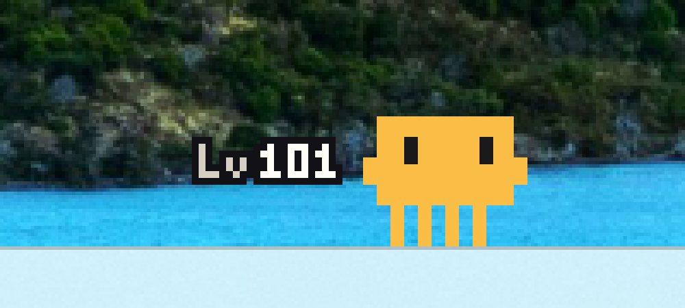

# claude-pet

> 내가 Claude를 쓰는 만큼 자라는 데스크톱 펫

Claude Code로 일하는 동안 작업 표시줄 위를 돌아다니며, 지금 Claude가 뭘 하고
있는지 몸 색으로 보여주고, 누적 사용량만큼 레벨이 오르는 Windows 데스크톱
펫 플러그인입니다.




## 왜 만들었나

Claude Code를 오래 쓰다 보면 사용량은 숫자로만 쌓입니다. 그 시간을 눈에
보이는 무언가로 남기고 싶었습니다. 그래서 "내가 Claude를 사용하는 만큼
성장하는 펫"을 만들었습니다. 펫은 트랜스크립트에서 누적 사용량을 계산해
레벨로 보여주고(금액은 어디에도 표시하지 않습니다), 레벨이 오르는 순간
주변에 링이 한 번 반짝입니다. 최대 레벨은 9999입니다.

동시에 한 가지 원칙을 지켰습니다. **펫은 장식이고, 작업을 1%도 방해해서는
안 된다.** 아래 설계 전체가 이 원칙에서 나왔습니다.

## 상태 한눈에

열려 있는 모든 Claude Code 세션을 지켜보다가, 가장 우선순위 높은 상태를
몸 색과 동작으로 보여줍니다.

| 색 | 상태 | 표현 |
|---|---|---|
| 산호주황 `#D6845A` | 대기 중 | 작업 표시줄 위를 어슬렁거림 |
| 산호주황 `#D6845A` | 당신 차례 | 머리 위에 물음표가 떠다님 |
| 파랑 `#78B4F0` | 읽는 중 (Read/Grep/검색) | 눈이 좌우로 스캔 |
| 초록 `#8CE196` | 쓰는 중 (Edit/Write) | |
| 호박색 `#FABE46` | 도구 실행 중 | 몸이 진행 방향으로 기울어 달림 |
| 회청색 `#9696A5` | 도구 오류 | 눈을 질끈 감고 휘청거림 |
| 빨강 `#E6463C` | 권한 승인 대기로 막힘 | 머리 위에 빠직(💢) 마크 |
| 거의 검정 `#34323C` | 오래 방치됨 | 바닥에 납작 엎드림 |
| 청회색 `#60647A` | 토큰 한도 도달 | 누워서 Zzz — 리셋 시각에 스스로 깨어남 |

여러 세션이 동시에 열려 있으면 세션별 상태를 종합해 하나로 보여줍니다.
"막힘 > 당신 차례 > 작업 중" 순서라, 어딘가에서 승인을 기다리고 있으면
놓치지 않습니다.

## 주요 기능

- **상태 반응** — 세션의 트랜스크립트(JSONL)를 실시간으로 따라 읽으며 위
  표의 상태를 판정합니다. Claude Code 쪽에는 아무 요청도 보내지 않습니다.
- **레벨** — 30초에 한 번 백그라운드에서 누적 사용량을 다시 계산해 `Lv`
  숫자로 표시합니다. 파일별 (크기, mtime)을 기억해 바뀐 파일만 다시
  읽으므로 트랜스크립트가 수 GB로 커져도 부담이 없습니다.
- **토큰 한도 낮잠** — 세션/주간 한도에 걸리면 펫이 누워서 잡니다. 리셋
  시각을 트랜스크립트에서 읽어 그 시각에 스스로 깨어나고, 그 전에 활동이
  재개되면 즉시 일어납니다.
- **방해하지 않음** — 창은 클릭을 통과시키고, 포커스를 뺏지 않고, 전체화면
  앱(게임 등)이 앞에 있으면 숨습니다. 모든 세션이 끝나면 약 10초 뒤 스스로
  종료합니다.

## 설치

Claude Code **터미널 채팅창**에서:

```
/plugin marketplace add Youl-AI/claude-pet
/plugin install claude-pet@claude-pet
```

설치 후 새 세션을 시작하면 펫이 나타납니다.

VSCode/데스크톱 앱의 GUI에서는 슬래시 명령이 인자를 받지 않으므로, 대신
**셸(PowerShell/cmd)**에서 같은 작업을 할 수 있습니다:

```powershell
claude plugin marketplace add Youl-AI/claude-pet
claude plugin install claude-pet@claude-pet
```

### 요구사항

- Windows 10/11
- [.NET Desktop Runtime 10 이상](https://dotnet.microsoft.com/download/dotnet)
  (이후 메이저 버전에서도 동작하도록 빌드되어 있습니다)
- Claude Code

### 업데이트

```
/plugin marketplace update claude-pet
/plugin install claude-pet@claude-pet
```

또는 셸에서 `claude plugin update claude-pet@claude-pet`. 적용에는 Claude
Code 재시작이 필요합니다. 서드파티 마켓플레이스는 자동 업데이트가 기본으로
꺼져 있으며, `/plugin` → Marketplaces에서 켤 수 있습니다.

### 제거

```powershell
claude plugin uninstall claude-pet@claude-pet
```

펫은 열려 있던 세션이 모두 끝나면 스스로 종료됩니다. 즉시 내리려면
`taskkill /IM claude-pet.exe /F`.

## 동작 방식

```
Claude Code 세션
  │  SessionStart / Notification / SessionEnd 훅 (비동기, 항상 exit 0)
  ▼
세션 레코드 (sessions/*.json)  ←  훅은 기록만 하고 즉시 반환
  │
  ▼
claude-pet.exe (WPF, 단일 인스턴스)
  ├─ 1초 주기: 세션 PID 생존 확인 + 트랜스크립트 tail → 상태 판정
  ├─ 30초 주기: 바뀐 트랜스크립트만 재스캔 → 레벨 계산
  └─ 모든 세션 종료 후 10초 → 스스로 종료
```

훅은 세션을 등록하고 펫 프로세스를 하나만 띄우는 일만 합니다. 그 뒤로는
펫이 트랜스크립트 파일을 **읽기 전용으로** 따라가며 모든 판단을 스스로
합니다. Claude Code에 요청을 보내거나 응답을 기다리는 경로가 아예 없습니다.

## 설계에서 중점을 둔 것

### 1. 간섭 제로

- **훅은 전부 비동기 + 무조건 `exit 0`** — 훅 스크립트 안에서 어떤 오류가
  나도 세션 진행을 막지 않습니다.
- **트랜스크립트는 `FileShare.ReadWrite | Delete`로 엽니다** — Claude Code가
  같은 파일을 쓰거나 지우는 것을 절대 막지 않습니다.
- **창은 완전히 투명한 존재입니다** — `WS_EX_TRANSPARENT`(클릭 통과),
  `WS_EX_NOACTIVATE`(포커스 안 뺏음), `WS_EX_TOOLWINDOW`(Alt+Tab에 안 나옴).
  전체화면 앱이 포그라운드에 오면 렌더링을 멈추고 숨습니다.
- **작업 폴더를 붙잡지 않습니다** — 프로세스의 작업 디렉터리를 자기 데이터
  폴더로 옮겨, 사용자가 프로젝트 폴더를 지우거나 옮기는 것을 막지 않습니다.

### 2. 점유율

측정값 기준(Windows 11, 0.5.2 이후):

- **CPU** — 대기(잠듦) 상태 0.0%, 애니메이션 중 단일 코어의 2~3% 수준.
  펫은 Idle로 20초가 지나면 렌더링 자체를 멈춥니다.
- **RAM** — 프라이빗 약 60~66 MB, 워킹셋 약 38~48 MB. 트랜스크립트 스캐너는
  재사용 바이트 버퍼로 줄을 모으고 `"usage"` 바이트 시퀀스가 있는 줄만
  문자열로 디코드해, 수백 파일·GB 단위 콜드 스캔에서도 할당이 늘지 않습니다.
  콜드 스캔 직후 한 번 LOH 압축과 워킹셋 트림을 수행합니다.
- **디스크/네트워크** — 네트워크 사용 없음. 쓰기는 자기 데이터 폴더의 상태
  파일뿐입니다.

### 3. 죽지 않기, 그리고 곱게 죽기

- **"절대 던지지 않는다" 계약** — 파일 파싱, 세션 열거, 렌더링 틱 전부가
  catch-all 경계 안에 있습니다. 손상된 JSON, 스캔 도중 삭제되는 파일, 권한
  변경 등 8가지 오류 주입 시나리오를 실제로 넣어 생존을 확인했습니다.
- **PID 워치독** — 종료 판정의 권위는 SessionEnd 훅이 아니라 세션 프로세스의
  생존 여부입니다. 훅은 크래시나 강제 종료에서 안 불리고 `/clear`에서 오발동
  하므로 믿지 않습니다. 모든 세션 PID가 죽으면 10초 뒤 스스로 종료합니다.
- **단일 인스턴스 + 서킷 브레이커** — 뮤텍스로 하나만 뜨고, 크래시 시 훅이
  되살리되 세션당 4회까지만 시도합니다(손상된 빌드가 무한 재기동하는 것 방지).
- **레벨은 단조 증가** — 일시적 파일 읽기 실패로 레벨이 내려가 보이는 일이
  없도록, 읽기 실패 시 캐시된 값을 유지합니다.

### 4. 레벨 곡선

초반은 로그(빠른 성장), L100부터는 선형입니다. L1은 첫 며칠 안에, L100은
헤비 유저 기준 한 달 정도로 잡혀 있습니다. 금액은 계산에만 쓰고 화면에는
절대 표시하지 않습니다.

## 프로젝트 구조

```
src/PetCore/        상태 머신, 트랜스크립트 파서, 레벨 계산, 워치독 (WPF 무의존)
src/PetApp/         WPF 창, 렌더링, 네이티브 창 스타일
tests/PetCore.Tests/  단위 테스트 190개
plugin/             훅 스크립트 + 배포 바이너리 (claude-pet.exe, 1MB 미만)
tools/spritegen/    스프라이트 시트 생성 스크립트 (Python)
bench/              간섭 측정 벤치마크 (파일 쓰기 지연 + CPU 경합)
docs/               설계 스펙, 구현 계획, 백로그
```

핵심 로직은 전부 `PetCore`에 있고 WPF에 의존하지 않아 단위 테스트로
검증됩니다. 렌더링을 제외한 모든 동작 — 상태 전이, 낮잠 진입/기상, 레벨
곡선, 세션 정리, 오류 내성 — 이 테스트 190개로 고정되어 있습니다.

## 개발 노트

이 프로젝트는 Claude Code의 서브에이전트 주도 개발로 만들어졌습니다.
스펙 → 구현 계획 → 태스크별 구현·리뷰 → 전체 브랜치 최종 리뷰의 사이클을
돌렸고, 설계 문서와 계획서가 `docs/superpowers/`에 그대로 남아 있습니다.

실측으로 결정한 것들:

- **토큰 한도 감지** — 문서에 없는 부분이라, 실제 한도 도달 시점의
  트랜스크립트를 뒤져 `"error":"rate_limit"` 레코드와
  `quota_auto_resume_fired` 알림 훅을 찾아 조합했습니다. 리셋 시각
  ("resets 6:10pm")도 그 텍스트에서 파싱합니다.
- **메모리 최적화** — 8 MB짜리 병리적 입력 줄을 실제로 주입해 스파이크를
  재현하고, 실사용 최대 줄(644개 파일 중 2.39 MB)을 측정한 뒤 상한을
  정했습니다. 결과: 프라이빗 84~110 MB → 61~66 MB.
- **간섭 측정** — 펫 ON/OFF를 무작위 순서로 반복하며 트랜스크립트 파일
  쓰기 지연과 CPU 바운드 연산 지연을 비교하는 벤치마크가 `bench/`에
  있습니다.
- **창 스타일 검증** — 문서상 플래그가 아니라 실행 중인 창 핸들에서
  `GWL_EXSTYLE`을 직접 읽어 확인했습니다.

## 유의사항과 알려진 제한

- **Windows 전용**입니다. macOS/Linux에서는 훅이 동작하지 않습니다(세션
  진행은 막지 않습니다).
- 펫은 **주 모니터에만** 나타납니다. 다중 모니터 지원은 백로그에 있습니다.
- 상태 판정은 트랜스크립트 해석에 기반하므로, Claude Code 포맷이 크게
  바뀌면 상태가 어긋날 수 있습니다. 그 경우에도 세션에는 영향이 없습니다.
- 남은 개선 계획은 [docs/BACKLOG.md](docs/BACKLOG.md)에 있습니다.

## 라이선스

[MIT](LICENSE)
